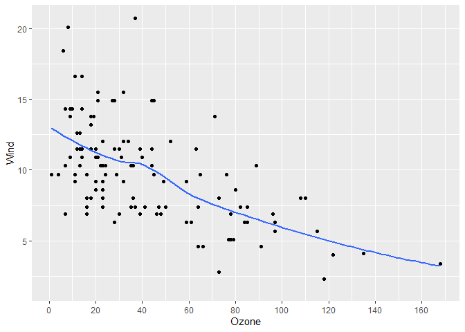

<!-- README.md is generated from README.Rmd. Please edit that file -->

# cheapr <a href="https://github.com/NicChr/cheapr"></a>

<!-- badges: start -->

[](https://github.com/NicChr/cheapr/actions/workflows/R-CMD-check.yaml)
[](https://CRAN.R-project.org/package=cheapr)
[](https://app.codecov.io/gh/NicChr/cheapr)

<!-- badges: end -->

In cheapr, ‘cheap’ means fast and memory-efficient, and that’s exactly
the philosophy that cheapr aims to follow.

## Installation

You can install cheapr like so:

``` r
install.packages("cheapr")
```

or you can install the development version of cheapr:

``` r
remotes::install_github("NicChr/cheapr")
```

Some common operations that cheapr can do much faster and more
efficiently include:

- Counting, finding, removing and replacing `NA` and scalar values

- Creating factors

- Creating multiple sequences in a vectorised way

- Sub-setting vectors and data frames efficiently

- Safe, flexible and fast greatest common divisor and lowest common
  multiple

- Lags/leads

- Lightweight `integer64` support

- In-memory Math (no copies, vectors updated by reference)

- Summary statistics of data frame variables

- Binning of continuous data

Let’s first load the required packages

``` r
library(cheapr)
library(bench)
```

### Scalars and `NA`

Because R mostly uses vectors and vectorised operations, this means that
there are few scalar-optimised operations.

cheapr provides tools to efficiently count, find, replace and remove
scalars.

``` r
# Setup data with NA values
set.seed(42)
x <- sample(1:5, 30, TRUE)
x <- na_insert(x, n = 7)

cheapr_table(x, order = TRUE) # Fast table()
#>    1    2    3    4    5 <NA> 
#>    6    6    3    4    4    7
```

`NA` functions

``` r
na_count(x)
#> [1] 7
na_rm(x)
#>  [1] 1 5 1 2 4 2 1 4 5 4 2 3 1 1 3 4 5 5 2 3 2 1 2
na_find(x)
#> [1]  4  8 11 15 22 24 26
na_replace(x, -99)
#>  [1]   1   5   1 -99   2   4   2 -99   1   4 -99   5   4   2 -99   3   1   1   3
#> [20]   4   5 -99   5 -99   2 -99   3   2   1   2
```

Scalar functions

``` r
val_count(x, 3)
#> [1] 3
val_rm(x, 3)
#>  [1]  1  5  1 NA  2  4  2 NA  1  4 NA  5  4  2 NA  1  1  4  5 NA  5 NA  2 NA  2
#> [26]  1  2
val_find(x, 3)
#> [1] 16 19 27
val_replace(x, 3, 99)
#>  [1]  1  5  1 NA  2  4  2 NA  1  4 NA  5  4  2 NA 99  1  1 99  4  5 NA  5 NA  2
#> [26] NA 99  2  1  2
```

Scalar based case-match

``` r
val_match(
  x, 
  1 ~ "one", 
  2 ~ "two",
  3 ~ "three", 
  .default = ">3"
)
#>  [1] "one"   ">3"    "one"   ">3"    "two"   ">3"    "two"   ">3"    "one"  
#> [10] ">3"    ">3"    ">3"    ">3"    "two"   ">3"    "three" "one"   "one"  
#> [19] "three" ">3"    ">3"    ">3"    ">3"    ">3"    "two"   ">3"    "three"
#> [28] "two"   "one"   "two"
```

## Efficient NA counts by row/col

``` r
m <- matrix(na_insert(rnorm(10^6), prop = 1/4), ncol = 10^3)
# Number of NA values by row
mark(row_na_counts(m), 
     rowSums(is.na(m)))
#> # A tibble: 2 × 6
#>   expression             min   median `itr/sec` mem_alloc `gc/sec`
#>   <bch:expr>        <bch:tm> <bch:tm>     <dbl> <bch:byt>    <dbl>
#> 1 row_na_counts(m)   457.1µs  479.4µs     1952.    9.15KB      0  
#> 2 rowSums(is.na(m))   2.65ms   2.94ms      316.    3.85MB     31.1
# Number of NA values by col
mark(col_na_counts(m), 
     colSums(is.na(m)))
#> # A tibble: 2 × 6
#>   expression             min   median `itr/sec` mem_alloc `gc/sec`
#>   <bch:expr>        <bch:tm> <bch:tm>     <dbl> <bch:byt>    <dbl>
#> 1 col_na_counts(m)    1.36ms   1.48ms      645.    9.14KB      0  
#> 2 colSums(is.na(m))   1.25ms   1.44ms      621.    3.82MB     60.3
```

`is_na` is a multi-threaded alternative to `is.na`

``` r
x <- rnorm(10^6) |> 
  na_insert(10^5)
options(cheapr.cores = 4)
mark(is.na(x), is_na(x))
#> # A tibble: 2 × 6
#>   expression      min   median `itr/sec` mem_alloc `gc/sec`
#>   <bch:expr> <bch:tm> <bch:tm>     <dbl> <bch:byt>    <dbl>
#> 1 is.na(x)      551µs    621µs     1436.    3.81MB     235.
#> 2 is_na(x)      153µs    173µs     4966.    3.82MB     501.
options(cheapr.cores = 1)
mark(is.na(x), is_na(x))
#> # A tibble: 2 × 6
#>   expression      min   median `itr/sec` mem_alloc `gc/sec`
#>   <bch:expr> <bch:tm> <bch:tm>     <dbl> <bch:byt>    <dbl>
#> 1 is.na(x)      549µs    616µs     1512.    3.81MB     191.
#> 2 is_na(x)      360µs    429µs     2210.    3.81MB     264.

### posixlt method is much faster
hours <- as.POSIXlt(seq.int(0, length.out = 10^6, by = 3600),
                    tz = "UTC") |> 
  na_insert(10^5)

mark(is.na(hours), is_na(hours))
#> Warning: Some expressions had a GC in every iteration; so filtering is
#> disabled.
#> # A tibble: 2 × 6
#>   expression        min   median `itr/sec` mem_alloc `gc/sec`
#>   <bch:expr>   <bch:tm> <bch:tm>     <dbl> <bch:byt>    <dbl>
#> 1 is.na(hours)    1.03s    1.03s     0.970   61.05MB    0.970
#> 2 is_na(hours)   3.79ms   3.97ms   230.       7.64MB   23.9
```

It differs in 2 regards:

- List elements are regarded as `NA` when either that element is an `NA`
  value or it is a list containing only `NA` values.
- For data frames, `is_na` returns a logical vector where `TRUE` defines
  an empty row of only `NA` values.

``` r
# List example
is.na(list(NA, list(NA, NA), 10))
#> [1]  TRUE FALSE FALSE
is_na(list(NA, list(NA, NA), 10))
#> [1]  TRUE  TRUE FALSE

# Data frame example
df <- new_df(x = c(1, NA, 3),
                 y = c(NA, NA, NA))
df
#>    x  y
#> 1  1 NA
#> 2 NA NA
#> 3  3 NA
is_na(df)
#> [1] FALSE  TRUE FALSE
is_na(df)
#> [1] FALSE  TRUE FALSE
# The below identity should hold
identical(is_na(df), row_na_counts(df) == ncol(df))
#> [1] TRUE
```

`is_na` and all the `NA` handling functions fall back on calling
`is.na()` if no suitable method is found. This means that custom objects
like vctrs rcrds and more are supported.

## Cheap data frame summaries with `overview`

Inspired by the excellent skimr package, `overview()` is a cheaper
alternative designed for larger data.

``` r
df <- new_df(
  x = sample.int(100, 10^6, TRUE),
  y = as_factor(sample(LETTERS, 10^6, TRUE)),
  z = rnorm(10^6)
)
overview(df)
#> obs: 1000000 
#> cols: 3 
#> 
#> ----- Numeric -----
#>   col n_missng p_complt n_unique     mean    p0   p25      p50   p75   p100
#> 1   x        0        1      100    50.52     1    25       51    76    100
#> 2   z        0        1  1000000 -0.00038 -4.58 -0.67 -0.00062  0.68   5.08
#>     iqr    sd  hist
#> 1    51 28.88 ▇▇▇▇▇
#> 2  1.35     1 ▁▃▇▂▁
#> 
#> ----- Categorical -----
#>   col n_missng p_complt n_unique n_levels min max
#> 1   y        0        1       26       26   A   Z
mark(overview(df, hist = FALSE))
#> # A tibble: 1 × 6
#>   expression                      min   median `itr/sec` mem_alloc `gc/sec`
#>   <bch:expr>                 <bch:tm> <bch:tm>     <dbl> <bch:byt>    <dbl>
#> 1 overview(df, hist = FALSE)     71ms   71.8ms      13.7        0B        0
```

## Cheaper and consistent subsetting with `sset`

``` r
sset(iris, 1:5)
#>   Sepal.Length Sepal.Width Petal.Length Petal.Width Species
#> 1          5.1         3.5          1.4         0.2  setosa
#> 2          4.9         3.0          1.4         0.2  setosa
#> 3          4.7         3.2          1.3         0.2  setosa
#> 4          4.6         3.1          1.5         0.2  setosa
#> 5          5.0         3.6          1.4         0.2  setosa
sset(iris, 1:5, j = "Species")
#>   Species
#> 1  setosa
#> 2  setosa
#> 3  setosa
#> 4  setosa
#> 5  setosa

# sset always returns a data frame when input is a data frame

sset(iris, 1, 1) # data frame
#>   Sepal.Length
#> 1          5.1
iris[1, 1] # not a data frame
#> [1] 5.1

x <- sample.int(10^6, 10^4, TRUE)
y <- sample.int(10^6, 10^4, TRUE)
mark(sset(x, x %in_% y), sset(x, x %in% y), x[x %in% y])
#> # A tibble: 3 × 6
#>   expression              min   median `itr/sec` mem_alloc `gc/sec`
#>   <bch:expr>         <bch:tm> <bch:tm>     <dbl> <bch:byt>    <dbl>
#> 1 sset(x, x %in_% y)   82.5µs    107µs     8401.      96KB     10.4
#> 2 sset(x, x %in% y)   157.2µs    172µs     5560.     286KB     30.6
#> 3 x[x %in% y]         153.1µs    166µs     5414.     325KB     30.8
```

`sset` uses an internal range-based subset when `i` is an ALTREP integer
sequence of the form m:n.

``` r
mark(sset(df, 0:10^5), df[0:10^5, , drop = FALSE])
#> # A tibble: 2 × 6
#>   expression                      min   median `itr/sec` mem_alloc `gc/sec`
#>   <bch:expr>                 <bch:tm> <bch:tm>     <dbl> <bch:byt>    <dbl>
#> 1 sset(df, 0:10^5)            135.4µs    194µs     3793.    1.53MB    56.7 
#> 2 df[0:10^5, , drop = FALSE]   6.75ms   7.41ms      134.    4.83MB     4.18
```

It also accepts negative indexes

``` r
mark(sset(df, -10^4:0), 
     df[-10^4:0, , drop = FALSE],
     check = FALSE) # The only difference is the row names
#> # A tibble: 2 × 6
#>   expression                       min   median `itr/sec` mem_alloc `gc/sec`
#>   <bch:expr>                  <bch:tm> <bch:tm>     <dbl> <bch:byt>    <dbl>
#> 1 sset(df, -10^4:0)            778.5µs   2.18ms     505.     15.1MB     133.
#> 2 df[-10^4:0, , drop = FALSE]   20.8ms  20.76ms      48.2    72.5MB     867.
```

The biggest difference between `sset` and `[` is the way logical vectors
are handled. The two main differences when `i` is a logical vector are:

- `NA` values are ignored, only the locations of `TRUE` values are used.
- `i` must be the same length as `x` and is not recycled.

``` r
# Examples with NAs
x <- c(1, 5, NA, NA, -5)
x[x > 0]
#> [1]  1  5 NA NA
sset(x, x > 0)
#> [1] 1 5

# Example with length(i) < length(x)
sset(x, TRUE)
#> Error in sset.default(x, TRUE): `length(i)` must match `length(x)` when `i` is a logical vector

# This is equivalent 
x[TRUE]
#> [1]  1  5 NA NA -5
# to..
sset(x)
#> [1]  1  5 NA NA -5
```

## Vector and data frame lags with `lag_()`

``` r
set.seed(37)
lag_(1:10, 3) # Lag(3)
#>  [1] NA NA NA  1  2  3  4  5  6  7
lag_(1:10, -3) # Lead(3)
#>  [1]  4  5  6  7  8  9 10 NA NA NA

# Using an example from data.table
library(data.table)
#> 
#> Attaching package: 'data.table'
#> The following object is masked from 'package:cheapr':
#> 
#>     address
dt <- data.table(year=2010:2014, v1=runif(5), v2=1:5, v3=letters[1:5])

# Similar to data.table::shift()

lag_(dt, 1) # Lag 
#>     year         v1    v2     v3
#>    <int>      <num> <int> <char>
#> 1:    NA         NA    NA   <NA>
#> 2:  2010 0.54964085     1      a
#> 3:  2011 0.07883715     2      b
#> 4:  2012 0.64879698     3      c
#> 5:  2013 0.49685336     4      d
lag_(dt, -1) # Lead
#>     year         v1    v2     v3
#>    <int>      <num> <int> <char>
#> 1:  2011 0.07883715     2      b
#> 2:  2012 0.64879698     3      c
#> 3:  2013 0.49685336     4      d
#> 4:  2014 0.71878731     5      e
#> 5:    NA         NA    NA   <NA>
```

With `lag_` we can update variables by reference, including entire data
frames

``` r
# At the moment, shift() cannot do this
lag_(dt, set = TRUE)
#>     year         v1    v2     v3
#>    <int>      <num> <int> <char>
#> 1:    NA         NA    NA   <NA>
#> 2:  2010 0.54964085     1      a
#> 3:  2011 0.07883715     2      b
#> 4:  2012 0.64879698     3      c
#> 5:  2013 0.49685336     4      d

dt # Was updated by reference
#>     year         v1    v2     v3
#>    <int>      <num> <int> <char>
#> 1:    NA         NA    NA   <NA>
#> 2:  2010 0.54964085     1      a
#> 3:  2011 0.07883715     2      b
#> 4:  2012 0.64879698     3      c
#> 5:  2013 0.49685336     4      d
```

`lag2_` is a more generalised variant that supports vectors of lags,
custom ordering and run lengths.

``` r
lag2_(dt, order = 5:1) # Reverse order lag (same as lead)
#>     year         v1    v2     v3
#>    <int>      <num> <int> <char>
#> 1:  2010 0.54964085     1      a
#> 2:  2011 0.07883715     2      b
#> 3:  2012 0.64879698     3      c
#> 4:  2013 0.49685336     4      d
#> 5:    NA         NA    NA   <NA>
lag2_(dt, -1) # Same as above
#>     year         v1    v2     v3
#>    <int>      <num> <int> <char>
#> 1:  2010 0.54964085     1      a
#> 2:  2011 0.07883715     2      b
#> 3:  2012 0.64879698     3      c
#> 4:  2013 0.49685336     4      d
#> 5:    NA         NA    NA   <NA>
lag2_(dt, c(1, -1)) # Alternating lead/lag
#>     year         v1    v2     v3
#>    <int>      <num> <int> <char>
#> 1:    NA         NA    NA   <NA>
#> 2:  2011 0.07883715     2      b
#> 3:  2010 0.54964085     1      a
#> 4:  2013 0.49685336     4      d
#> 5:  2012 0.64879698     3      c
lag2_(dt, c(-1, 0, 0, 0, 0)) # Lead e.g. only first row
#>     year         v1    v2     v3
#>    <int>      <num> <int> <char>
#> 1:  2010 0.54964085     1      a
#> 2:  2010 0.54964085     1      a
#> 3:  2011 0.07883715     2      b
#> 4:  2012 0.64879698     3      c
#> 5:  2013 0.49685336     4      d
```

## Greatest common divisor and smallest common multiple

``` r
gcd2(5, 25)
#> [1] 5
scm2(5, 6)
#> [1] 30

gcd(seq(5, 25, by = 5))
#> [1] 5
scm(seq(5, 25, by = 5))
#> [1] 300

x <- seq(1L, 1000000L, 1L)
mark(gcd(x))
#> # A tibble: 1 × 6
#>   expression      min   median `itr/sec` mem_alloc `gc/sec`
#>   <bch:expr> <bch:tm> <bch:tm>     <dbl> <bch:byt>    <dbl>
#> 1 gcd(x)        800ns      1µs   904052.        0B     90.4
x <- seq(0, 10^6, 0.5)
mark(gcd(x))
#> # A tibble: 1 × 6
#>   expression      min   median `itr/sec` mem_alloc `gc/sec`
#>   <bch:expr> <bch:tm> <bch:tm>     <dbl> <bch:byt>    <dbl>
#> 1 gcd(x)       30.9ms   32.6ms      30.9        0B        0
```

## Creating many sequences

As an example, to create 3 sequences with different increments,  
the usual approach might be to use lapply to loop through the increment
values together with `seq()`

``` r
# Base R
increments <- c(1, 0.5, 0.1)
start <- 1
end <- 5
unlist(lapply(increments, \(x) seq(start, end, x)))
#>  [1] 1.0 2.0 3.0 4.0 5.0 1.0 1.5 2.0 2.5 3.0 3.5 4.0 4.5 5.0 1.0 1.1 1.2 1.3 1.4
#> [20] 1.5 1.6 1.7 1.8 1.9 2.0 2.1 2.2 2.3 2.4 2.5 2.6 2.7 2.8 2.9 3.0 3.1 3.2 3.3
#> [39] 3.4 3.5 3.6 3.7 3.8 3.9 4.0 4.1 4.2 4.3 4.4 4.5 4.6 4.7 4.8 4.9 5.0
```

In cheapr you can use `seq_()` which accepts vector arguments.

``` r
seq_(start, end, increments)
#>  [1] 1.0 2.0 3.0 4.0 5.0 1.0 1.5 2.0 2.5 3.0 3.5 4.0 4.5 5.0 1.0 1.1 1.2 1.3 1.4
#> [20] 1.5 1.6 1.7 1.8 1.9 2.0 2.1 2.2 2.3 2.4 2.5 2.6 2.7 2.8 2.9 3.0 3.1 3.2 3.3
#> [39] 3.4 3.5 3.6 3.7 3.8 3.9 4.0 4.1 4.2 4.3 4.4 4.5 4.6 4.7 4.8 4.9 5.0
```

Use `add_id = TRUE` to label the individual sequences.

``` r
seq_(start, end, increments, add_id = TRUE)
#>   1   1   1   1   1   2   2   2   2   2   2   2   2   2   3   3   3   3   3   3 
#> 1.0 2.0 3.0 4.0 5.0 1.0 1.5 2.0 2.5 3.0 3.5 4.0 4.5 5.0 1.0 1.1 1.2 1.3 1.4 1.5 
#>   3   3   3   3   3   3   3   3   3   3   3   3   3   3   3   3   3   3   3   3 
#> 1.6 1.7 1.8 1.9 2.0 2.1 2.2 2.3 2.4 2.5 2.6 2.7 2.8 2.9 3.0 3.1 3.2 3.3 3.4 3.5 
#>   3   3   3   3   3   3   3   3   3   3   3   3   3   3   3 
#> 3.6 3.7 3.8 3.9 4.0 4.1 4.2 4.3 4.4 4.5 4.6 4.7 4.8 4.9 5.0
```

If you know the sizes of your sequences beforehand, use `sequence_()`

``` r
seq_sizes <- c(3, 5, 10)
sequence_(seq_sizes, from = 0, by = 1/3, add_id = TRUE)
#>         1         1         1         2         2         2         2         2 
#> 0.0000000 0.3333333 0.6666667 0.0000000 0.3333333 0.6666667 1.0000000 1.3333333 
#>         3         3         3         3         3         3         3         3 
#> 0.0000000 0.3333333 0.6666667 1.0000000 1.3333333 1.6666667 2.0000000 2.3333333 
#>         3         3 
#> 2.6666667 3.0000000
```

You can also calculate the sequence sizes using `seq_size()`

``` r
seq_size(start, end, increments)
#> [1]  5  9 41
```

## ‘Cheaper’ Base R alternatives

### which

``` r
x <- rep(TRUE, 10^6)
mark(cheapr_which = which_(x),
     base_which = which(x))
#> # A tibble: 2 × 6
#>   expression        min   median `itr/sec` mem_alloc `gc/sec`
#>   <bch:expr>   <bch:tm> <bch:tm>     <dbl> <bch:byt>    <dbl>
#> 1 cheapr_which   2.44ms    3.1ms      280.    3.82MB     13.4
#> 2 base_which    544.4µs  624.4µs     1120.    7.63MB    105.
x <- rep(FALSE, 10^6)
mark(cheapr_which = which_(x),
     base_which = which(x))
#> # A tibble: 2 × 6
#>   expression        min   median `itr/sec` mem_alloc `gc/sec`
#>   <bch:expr>   <bch:tm> <bch:tm>     <dbl> <bch:byt>    <dbl>
#> 1 cheapr_which    118µs    125µs     7542.        0B       0 
#> 2 base_which      224µs    238µs     3822.    3.81MB     136.
x <- c(rep(TRUE, 5e05), rep(FALSE, 1e06))
mark(cheapr_which = which_(x),
     base_which = which(x))
#> # A tibble: 2 × 6
#>   expression        min   median `itr/sec` mem_alloc `gc/sec`
#>   <bch:expr>   <bch:tm> <bch:tm>     <dbl> <bch:byt>    <dbl>
#> 1 cheapr_which   1.33ms   1.61ms      569.    1.91MB     10.9
#> 2 base_which    516.8µs  786.6µs     1216.    7.63MB     94.0
x <- c(rep(FALSE, 5e05), rep(TRUE, 1e06))
mark(cheapr_which = which_(x),
     base_which = which(x))
#> # A tibble: 2 × 6
#>   expression        min   median `itr/sec` mem_alloc `gc/sec`
#>   <bch:expr>   <bch:tm> <bch:tm>     <dbl> <bch:byt>    <dbl>
#> 1 cheapr_which    894µs   1.06ms      884.    3.81MB     38.5
#> 2 base_which      707µs 825.45µs      924.    9.54MB    110.
x <- sample(c(TRUE, FALSE), 10^6, TRUE)
x[sample.int(10^6, 10^4)] <- NA
mark(cheapr_which = which_(x),
     base_which = which(x))
#> # A tibble: 2 × 6
#>   expression        min   median `itr/sec` mem_alloc `gc/sec`
#>   <bch:expr>   <bch:tm> <bch:tm>     <dbl> <bch:byt>    <dbl>
#> 1 cheapr_which  573.4µs  693.9µs     1360.    1.89MB     22.3
#> 2 base_which     3.52ms   3.93ms      248.     5.7MB     13.3
```

### factor

``` r
x <- sample(seq(-10^3, 10^3, 0.01))
y <- do.call(paste0, expand.grid(letters, letters, letters, letters))
mark(cheapr_factor = factor_(x), 
     base_factor = factor(x))
#> # A tibble: 2 × 6
#>   expression         min   median `itr/sec` mem_alloc `gc/sec`
#>   <bch:expr>    <bch:tm> <bch:tm>     <dbl> <bch:byt>    <dbl>
#> 1 cheapr_factor   8.53ms    9.6ms    103.      4.59MB     4.48
#> 2 base_factor   287.87ms    288ms      3.47   27.84MB     0
mark(cheapr_factor = factor_(x, order = FALSE), 
     base_factor = factor(x, levels = unique(x)))
#> # A tibble: 2 × 6
#>   expression         min   median `itr/sec` mem_alloc `gc/sec`
#>   <bch:expr>    <bch:tm> <bch:tm>     <dbl> <bch:byt>    <dbl>
#> 1 cheapr_factor   2.99ms   3.37ms    280.      1.53MB     4.37
#> 2 base_factor   452.46ms 452.46ms      2.21   22.79MB     2.21
mark(cheapr_factor = factor_(y), 
     base_factor = factor(y))
#> Warning: Some expressions had a GC in every iteration; so filtering is
#> disabled.
#> # A tibble: 2 × 6
#>   expression         min   median `itr/sec` mem_alloc `gc/sec`
#>   <bch:expr>    <bch:tm> <bch:tm>     <dbl> <bch:byt>    <dbl>
#> 1 cheapr_factor    194ms 196.99ms     5.10     5.23MB    0    
#> 2 base_factor      2.62s    2.62s     0.381   54.35MB    0.381
mark(cheapr_factor = factor_(y, order = FALSE), 
     base_factor = factor(y, levels = unique(y)))
#> # A tibble: 2 × 6
#>   expression         min   median `itr/sec` mem_alloc `gc/sec`
#>   <bch:expr>    <bch:tm> <bch:tm>     <dbl> <bch:byt>    <dbl>
#> 1 cheapr_factor   4.09ms   4.76ms     203.     3.49MB     12.2
#> 2 base_factor    40.66ms  45.54ms      22.4   39.89MB     33.5
```

### intersect & setdiff

``` r
x <- sample.int(10^6, 10^5, TRUE)
y <- sample.int(10^6, 10^5, TRUE)
mark(cheapr_intersect = intersect_(x, y, dups = FALSE),
     base_intersect = intersect(x, y))
#> # A tibble: 2 × 6
#>   expression            min   median `itr/sec` mem_alloc `gc/sec`
#>   <bch:expr>       <bch:tm> <bch:tm>     <dbl> <bch:byt>    <dbl>
#> 1 cheapr_intersect   1.83ms   2.06ms      444.    1.18MB     6.91
#> 2 base_intersect     3.23ms   3.66ms      263.    5.16MB    18.8
mark(cheapr_setdiff = setdiff_(x, y, dups = FALSE),
     base_setdiff = setdiff(x, y))
#> # A tibble: 2 × 6
#>   expression          min   median `itr/sec` mem_alloc `gc/sec`
#>   <bch:expr>     <bch:tm> <bch:tm>     <dbl> <bch:byt>    <dbl>
#> 1 cheapr_setdiff   1.83ms   1.99ms      471.    1.77MB     12.1
#> 2 base_setdiff     3.33ms   3.56ms      270.    5.71MB     22.0
```

### `%in_%` and `%!in_%`

``` r
mark(cheapr = x %in_% y,
     base = x %in% y)
#> # A tibble: 2 × 6
#>   expression      min   median `itr/sec` mem_alloc `gc/sec`
#>   <bch:expr> <bch:tm> <bch:tm>     <dbl> <bch:byt>    <dbl>
#> 1 cheapr       1.31ms    1.4ms      681.  781.34KB     6.64
#> 2 base         2.06ms   2.24ms      430.    2.53MB    14.0
mark(cheapr = x %!in_% y,
     base = !x %in% y)
#> # A tibble: 2 × 6
#>   expression      min   median `itr/sec` mem_alloc `gc/sec`
#>   <bch:expr> <bch:tm> <bch:tm>     <dbl> <bch:byt>    <dbl>
#> 1 cheapr       1.26ms   1.44ms      656.  787.84KB     4.21
#> 2 base          2.2ms   2.45ms      393.    2.91MB     8.77
```

### `as_discrete`

`as_discrete` is a cheaper alternative to `cut`

``` r
x <- rnorm(10^6)
b <- seq(0, max(x), 0.2)
mark(cheapr_cut = as_discrete(x, b, left = FALSE), 
     base_cut = cut(x, b))
#> # A tibble: 2 × 6
#>   expression      min   median `itr/sec` mem_alloc `gc/sec`
#>   <bch:expr> <bch:tm> <bch:tm>     <dbl> <bch:byt>    <dbl>
#> 1 cheapr_cut   13.8ms   14.8ms      67.3    3.87MB     4.34
#> 2 base_cut     42.5ms   44.5ms      22.5   26.76MB     8.45
```

### `cheapr_if_else`

A cheap alternative to `ifelse`

``` r
mark(
  cheapr_if_else(x >= 0, "pos", "neg"),
  ifelse(x >= 0, "pos", "neg"),
  data.table::fifelse(x >= 0, "pos", "neg")
)
#> # A tibble: 3 × 6
#>   expression                           min   median `itr/sec` mem_alloc `gc/sec`
#>   <bch:expr>                      <bch:tm> <bch:tm>     <dbl> <bch:byt>    <dbl>
#> 1 "cheapr_if_else(x >= 0, \"pos\…   8.79ms   9.52ms    102.      11.4MB     24.9
#> 2 "ifelse(x >= 0, \"pos\", \"neg… 129.33ms 129.33ms      7.73    53.4MB     23.2
#> 3 "data.table::fifelse(x >= 0, \…   9.22ms    9.8ms    100.      11.4MB     21.1
```

### `case`

cheapr’s version of a case-when statement, with mostly the same
arguments as `dplyr::case_when` but similar efficiency as
`data.table::fcase`

``` r
mark(case(
    x >= 0 ~ "pos", 
    x < 0 ~ "neg", 
    .default = "Unknown"
),
data.table::fcase(
    x >= 0, "pos", 
    x < 0, "neg", 
    rep_len(TRUE, length(x)), "Unknown"
))
#> # A tibble: 2 × 6
#>   expression                             min median `itr/sec` mem_alloc `gc/sec`
#>   <bch:expr>                          <bch:> <bch:>     <dbl> <bch:byt>    <dbl>
#> 1 "case(x >= 0 ~ \"pos\", x < 0 ~ \"… 17.5ms 18.9ms      52.4    28.7MB     37.4
#> 2 "data.table::fcase(x >= 0, \"pos\"… 15.8ms 16.9ms      58.4    26.7MB     36.5
```

`val_match` is an even cheaper special variant of `case` when all LHS
expressions are length-1 vectors, i.e scalars

``` r
x <- round(rnorm(10^6))

mark(
  val_match(x, 1 ~ Inf, 2 ~ -Inf, .default = NaN),
     case(x == 1 ~ Inf, 
          x == 2 ~ -Inf, 
          .default = NaN),
     data.table::fcase(x == 1, Inf, 
          x == 2, -Inf, 
          rep_len(TRUE, length(x)), NaN)
     )
#> # A tibble: 3 × 6
#>   expression                            min  median `itr/sec` mem_alloc `gc/sec`
#>   <bch:expr>                        <bch:t> <bch:t>     <dbl> <bch:byt>    <dbl>
#> 1 val_match(x, 1 ~ Inf, 2 ~ -Inf, …  3.22ms  3.67ms     250.     8.79MB     27.5
#> 2 case(x == 1 ~ Inf, x == 2 ~ -Inf… 12.88ms 14.52ms      69.0   27.63MB     49.8
#> 3 data.table::fcase(x == 1, Inf, x… 11.83ms 12.95ms      74.7   30.52MB     65.4
```

`get_breaks` is a very fast function for generating pretty equal-width
breaks It is similar to `base::pretty` though somewhat less flexible
with simpler arguments.

``` r
x <- with_local_seed(rnorm(10^5), 112)
# approximately 10 breaks
get_breaks(x, 10)
#> [1] -6 -4 -2  0  2  4  6
pretty(x, 10)
#>  [1] -6 -5 -4 -3 -2 -1  0  1  2  3  4  5

mark(
  get_breaks(x, 20),
  pretty(x, 20), 
  check = FALSE
)
#> # A tibble: 2 × 6
#>   expression             min   median `itr/sec` mem_alloc `gc/sec`
#>   <bch:expr>        <bch:tm> <bch:tm>     <dbl> <bch:byt>    <dbl>
#> 1 get_breaks(x, 20)   60.9µs   64.8µs    14306.        0B      0  
#> 2 pretty(x, 20)      401.2µs  566.1µs     1747.    1.91MB     28.4

# Not pretty but equal width breaks
get_breaks(x, 5, pretty = FALSE)
#> [1] -5.0135893 -3.2004889 -1.3873886  0.4257118  2.2388121  4.0519125
diff(get_breaks(x, 5, pretty = FALSE)) # Widths
#> [1] 1.8131 1.8131 1.8131 1.8131 1.8131
```

It can accept both data and a length-two vector representing a range,
meaning it can easily be used in ggplot2 and base R plots

``` r
library(ggplot2)
gg <- airquality |> 
    ggplot(aes(x = Ozone, y = Wind)) +
    geom_point() + 
    geom_smooth(se = FALSE)

# Add our breaks
gg +
  scale_x_continuous(breaks = get_breaks)
#> `geom_smooth()` using method = 'loess' and formula = 'y ~ x'
#> Warning: Removed 37 rows containing non-finite outside the scale range
#> (`stat_smooth()`).
#> Warning: Removed 37 rows containing missing values or values outside the scale range
#> (`geom_point()`).
```


``` r

# More breaks

# get_breaks accepts a range too
gg +
  scale_x_continuous(breaks = \(x) get_breaks(range(x), 20)) 
#> `geom_smooth()` using method = 'loess' and formula = 'y ~ x'
#> Warning: Removed 37 rows containing non-finite outside the scale range
#> (`stat_smooth()`).
#> Removed 37 rows containing missing values or values outside the scale range
#> (`geom_point()`).
```


